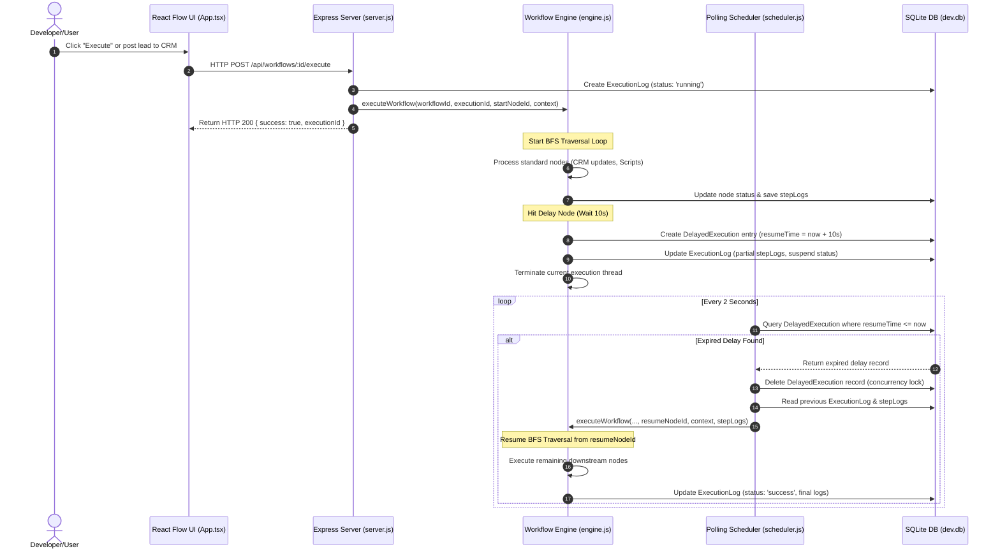

# NEURON_FLOW & Automation Pipeline: Full System Architecture & Data Flows Guide

This guide provides a comprehensive overview of the application architecture, system components, connection streams, and runtime mechanics for the workspace project. It is designed to help developers and agentic AI systems quickly understand the database schemas, API connections, execution engine, and execution lifecycles.

---

## 📂 1. Workspace Layout & High-Level Components

The workspace is organized as a hybrid structure with a root Next.js dashboard project and a fully functional workflow automation subproject:

```
.
├── automation-workflow/         # Workflow Automation Subproject
│   ├── backend/                 # Express backend, custom engine & scheduler
│   │   ├── engine.js            # Node execution engine (step-by-step queue)
│   │   ├── scheduler.js         # Delays checking loop (polling database)
│   │   └── server.js            # Express REST API endpoint definitions
│   ├── frontend/                # React Flow + Vite SPA
│   │   ├── src/
│   │   │   ├── App.tsx          # Workflow editor, canvas and executions panel
│   │   │   └── CustomNode.tsx   # React Flow node visual cards & handles
│   │   └── index.html           # Subproject HTML entrypoint
│   └── prisma/                  # SQLite schema definitions
│       └── schema.prisma        # Database models & configuration
│
├── pages/                       # Root Next.js Pages (Neuron Flow Landing Page)
├── server/                      # Root Companion Express Server (Health Check)
├── package.json                 # Workspace dependencies runner
└── ARCHITECTURE.md              # [This File] Architecture & Connection Streams
```

### Server Port Configurations & Concurrency
* **Next.js Frontend (Root):** Runs on [http://localhost:3000](http://localhost:3000) using `npm run dev` from root.
* **Companion Root Express Server:** Runs on [http://localhost:4000](http://localhost:4000) using `npm run server` from root.
* **Automation Workflow Frontend:** Runs on [http://localhost:5173](http://localhost:5173) (Vite SPA dev port) inside `./automation-workflow/frontend`.
* **Automation Workflow Backend:** Runs on [http://localhost:4000](http://localhost:4000) inside `./automation-workflow/backend`.
  > [!IMPORTANT]
  > Because both the Companion Root Server and the Automation Workflow Backend default to Port `4000`, running both stacks simultaneously will cause a port conflict. If both projects are run, modify `PORT` in the environment or files.

---

## 🛠️ 2. Subproject Technical Stack

1. **Frontend:** React Flow v11 (node graph editor), Vite (build tool), Material UI / Icons (styling).
2. **Backend:** Express API, Node.js.
3. **Database & ORM:** SQLite database (`dev.db`), Prisma Client.
4. **Dependencies Context:**
   > [!NOTE]
   > `package.json` in `automation-workflow/backend` references `bullmq` and `ioredis`. However, **BullMQ is NOT used** in the current implementation. Task serialization, deferred execution, and flow queues are handled entirely via the custom database-backed scheduler (`scheduler.js`) and inline JavaScript memory queues (`engine.js`).

---

## 📊 3. Detailed Modular Architecture Diagram

The diagram below details the folder structure, code files, and connection hooks classified by architectural layer (Client UI, API, Core Engine, Database):

```mermaid
graph TB
    subgraph UI_Layer ["Frontend / Client Layer (React Flow)"]
        main_tsx["main.tsx<br/>(Entrypoint)"]
        app_tsx["App.tsx<br/>(State, Canvas, Exec Panel)"]
        custom_node_tsx["CustomNode.tsx<br/>(Node UI Templates & Handles)"]
    end

    subgraph API_Layer ["API & Server Routing Layer (Express)"]
        server_js["server.js<br/>(Express Port 4000 REST Routing)"]
        workflow_routes["Workflow CRUD & Manual Execute Route<br/>(GET/POST/PUT/DELETE /api/workflows)"]
        execution_routes["Execution History & Rerun Routes<br/>(GET/DELETE /api/executions)"]
        webhook_routes["Webhooks Route<br/>(POST /api/webhooks/:workflowId)"]
        crm_routes["Mock CRM & Simulated Mail Routes<br/>(GET/POST /api/crm/*)"]
    end

    subgraph Core_Engine_Layer ["Execution & Engine Services"]
        engine_js["engine.js<br/>(BFS Queue Traversal Loop)"]
        scheduler_js["scheduler.js<br/>(Delayed Resumption Loop - 2s interval)"]
        eval_expr["evaluateCondition()<br/>(Template Var Replace & Safe Function Exec)"]
        eval_code["evaluateCode()<br/>(Dynamic Script Run Wrapper)"]
    end

    subgraph Persistence_Layer ["ORM & Database System"]
        prisma_schema["schema.prisma<br/>(SQLite Database Models)"]
        dev_db[("dev.db SQLite File")]
    end

    %% Dependency Connections
    main_tsx --> app_tsx
    app_tsx --> custom_node_tsx
    app_tsx -->|HTTP REST Requests| server_js

    server_js --> workflow_routes
    server_js --> execution_routes
    server_js --> webhook_routes
    server_js --> crm_routes

    workflow_routes -->|async invoke executeWorkflow()| engine_js
    webhook_routes -->|async invoke executeWorkflow()| engine_js
    crm_routes -->|Prisma CRUD / CRM Event Triggers| engine_js
    
    scheduler_js -->|async resume executeWorkflow()| engine_js

    engine_js -->|Prisma Client CRUD| prisma_schema
    scheduler_js -->|Prisma Client CRUD| prisma_schema
    server_js -->|Prisma Client CRUD| prisma_schema
    prisma_schema --> dev_db
```

---

## ⚡ 4. Detailed Connection Streams & Sequence Flow

This sequence chart outlines the chronological data flow starting from execution trigger, hitting a delay, suspending execution, and automatically resuming through the scheduler loop:



---

## ⚙️ 5. Runtime Execution Mechanics

### 1. Traversal Algorithm (engine.js)
* The engine uses a BFS-like queue logic (`let queue = [currentNodeId]`).
* While the queue is not empty, it shifts the active node, runs its corresponding business logic, stores its returned payload in `context.steps[nodeId]`, and queues target nodes linked by outgoing edges.
* Branching handle routing (`ifelse` node) only queues the true/false connection matching the logic evaluation.

### 2. Variable Resolving System
Placeholders formatted as `{{trigger.path}}` or `{{steps.nodeId.path}}` are dynamically parsed by traversing the context tree.
* **Example:** `to: "{{trigger.email}}"` replaces the value with the email field of the trigger payload.
* **Resolution Function:**
  ```javascript
  let resolvedText = text.replace(/\{\{([^}]+)\}\}/g, (_, path) => {
    const parts = path.trim().split('.');
    let val = context;
    for (const part of parts) {
      val = val?.[part];
    }
    return val ?? '';
  });
  ```

### 3. Dynamic Script Evaluation
For `ifelse` and `code` nodes, JavaScript logic is evaluated inside a safe function wrapper with arguments mapping to `context`:
* **If/Else Condition:**
  ```javascript
  const run = new Function('context', `
    try {
      const trigger = context.trigger || {};
      const steps = context.steps || {};
      return Boolean(${resolvedExpr});
    } catch(e) {
      return false;
    }
  `);
  ```
* **Custom JS Script (`code` node):**
  ```javascript
  const run = new Function('context', `
    try {
      ${codeString}
    } catch(e) {
      return { error: e.message };
    }
  `);
  ```

---

## 🗄️ 6. Database Schema (schema.prisma)

SQLite entities managed by Prisma:

| Model Name | Description | Key Fields / Relations |
|---|---|---|
| **`User`** | System user profile | `id`, `email`, `name`, `workflows (1:N)` |
| **`Workflow`** | Pipeline design layout schema | `id`, `name`, `definition (JSON string of nodes & edges)`, `isActive` |
| **`ExecutionLog`** | Runtime history logs & data | `id`, `workflowId (N:1)`, `status (running/success/failed)`, `logs (JSON step logs)`, `triggerData`, `responseData` |
| **`CRMContact`** | Simulated lead accounts database | `id`, `name`, `email (unique)`, `status (lead/contact/customer)`, `score (int)` |
| **`SimulatedEmail`** | Outgoing simulated email history | `id`, `to`, `subject`, `body`, `sentAt` |
| **`DelayedExecution`** | State storage for suspended delay flows | `id`, `workflowId`, `executionId`, `nodeId (target)`, `resumeTime`, `contextData (JSON context)` |

---

## 💡 7. Developer & Agent Guidelines

When modifying this repository, follow these best practices:

* **Adding New Node Types:**
  1. **Frontend:** Register the new visual component in `CustomNode.tsx` and map its type in `nodeTypes` inside `App.tsx`.
  2. **Backend:** Add a handling block for the new node type in `engine.js` inside the `while(queue.length > 0)` node processing block. Define what output structure it records in `context.steps[node.id]`.
* **Database Updates:**
  - If changing `schema.prisma`, sync the SQLite local database by running `npx prisma db push` inside `./automation-workflow`. Regenerate the client if necessary using `npm run generate`.
* **Testing Delayed Jobs:**
  - You can view active delayed queues by checking the `DelayedExecution` table directly. The polling interval in `server.js` defaults to `2000ms` (2 seconds), which can be tuned lower for automated test scripts.
