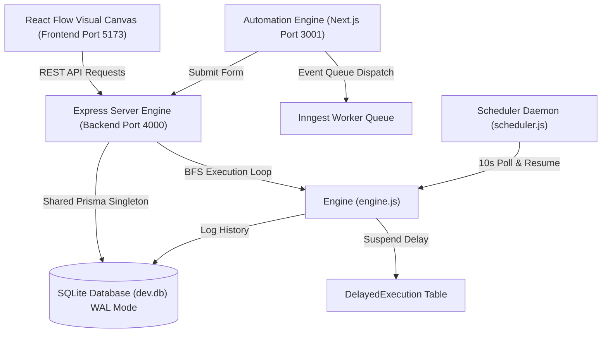
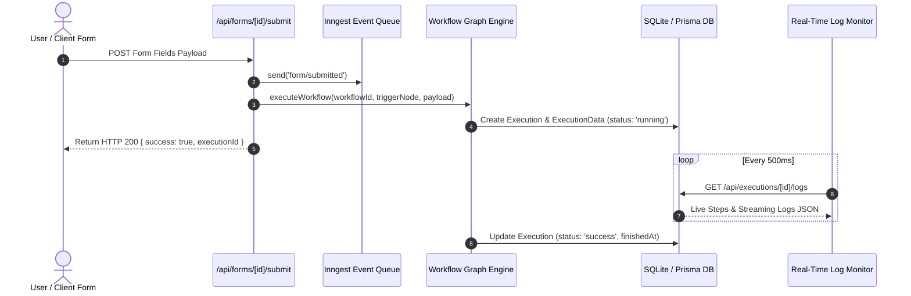

# 📐 NEURON_FLOW Architecture & Data Flow Guide

This document explains the technical architecture, data flows, database engine optimizations, and node design patterns of **NEURON_FLOW**.

---

## 🏛️ 1. High-Level Architecture Overview

NEURON_FLOW consists of four complementary layers:

1. **Client / Canvas Layer (`automation-workflow/frontend`)**:
   - Built on **React Flow** with custom nodes ([CustomNode.tsx](file:///d:/.vscode/workspace/automation-workflow/frontend/src/CustomNode.tsx)).
   - **Node Palette**: Includes Excel Processor, MCP Connector, Schedule Trigger (10s timers), Email Dispatcher, Google Sheets, OpenAI, Slack, Discord.
   - **Dual Sidebar Customization Sliders**:
     - Left Sidebar: Interactive **Sidebar Width** (180px–360px) and **Node Scale** (75%–125%) sliders.
     - Right Sidebar: Parameter sliders for Delay duration, Schedule interval, CRM score increment, If/Else condition threshold, Google Sheets row limit, and OpenAI temperature/tokens.

2. **Ingest Engine & Worker Queue Layer (`automation-engine`)**:
   - Next.js 15 app serving `POST /api/forms/[id]/submit` form ingestion and real-time execution log streaming (`GET /api/executions/[id]/logs`).
   - Background worker event processing powered by **Inngest** (`form/submitted`).

3. **Backend Engine Layer (`automation-workflow/backend`)**:
   - Express server handling workflow CRUD, execution streams, webhook endpoints, and CRM operations.
   - Centralized Prisma Client singleton ([db.js](file:///d:/.vscode/workspace/automation-workflow/backend/db.js)) configured with **WAL Mode** (`PRAGMA journal_mode=WAL;`) and `connection_limit=1` connection pool queueing to prevent SQLite database locking timeouts (`P1008`).

4. **Engine & Scheduler Layer (`engine.js` & `scheduler.js`)**:
   - Asynchronous BFS graph traversal engine supporting topological wave partitioning.
   - Dedicated database-backed delay scheduler polling `DelayedExecution` entries and executing 10-second recurring timers.

---

## 🔄 2. Ingest Submission & Real-Time Monitoring Flow

---

## 🗄️ 3. Monorepo Database Models

| Subproject | Model | Description |
| :--- | :--- | :--- |
| **`automation-workflow`** | **`User`** | System user profile & Clerk sync |
| | **`Workflow`** | Pipeline graph layout (`nodes`, `edges` JSON) |
| | **`ExecutionLog`** | History & step execution logs |
| | **`CRMContact`** | Simulated CRM lead contacts |
| | **`SimulatedEmail`** | Sent email records |
| | **`DelayedExecution`** | Suspended delay states |
| **`automation-engine`** | **`Form`** | Form definitions & workflow trigger bindings |
| | **`Execution` & `ExecutionData`** | Ingest run states & execution log arrays |
| | **`McpConnection`** | MCP server configurations & tool schemas |

---

## 🛠️ 4. Development & Build Verification Commands

- `npm run dev:all`: Launch Next.js dashboard, Ingest engine, visual canvas, and Express backend concurrently.
- `npm run build`: Production build of root Next.js dashboard.
- `npm run build:prod`: Production build of `automation-engine` Turbo monorepo.
- `cd automation-workflow/frontend && npm run build`: Production bundle for visual canvas UI.

Happy architecting! 🚀
