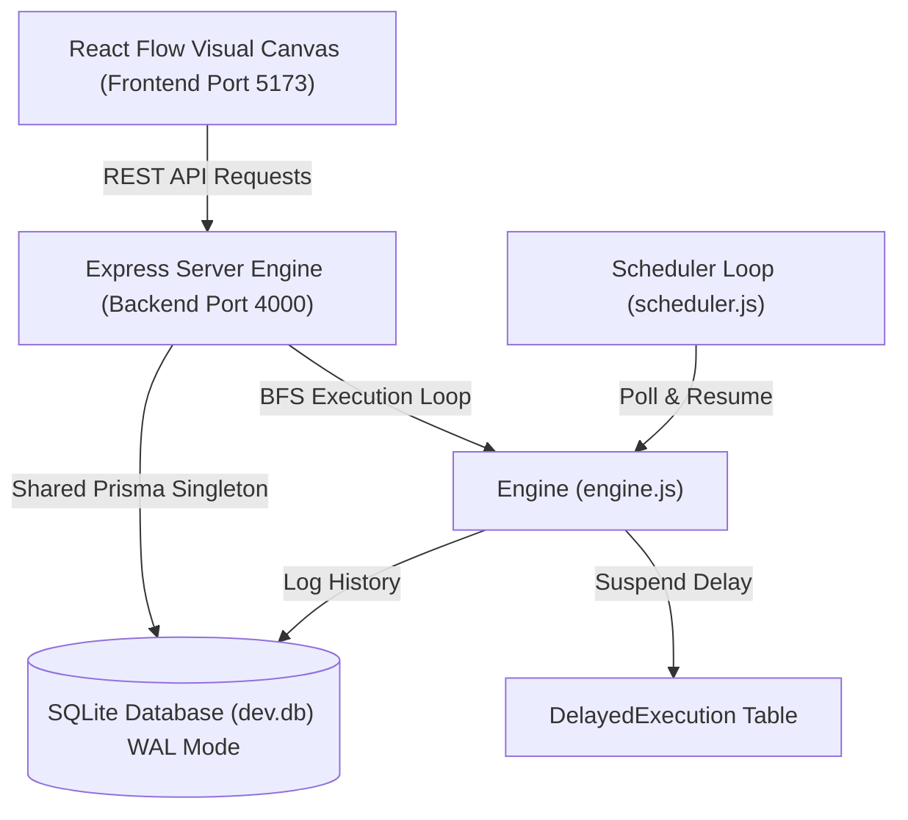
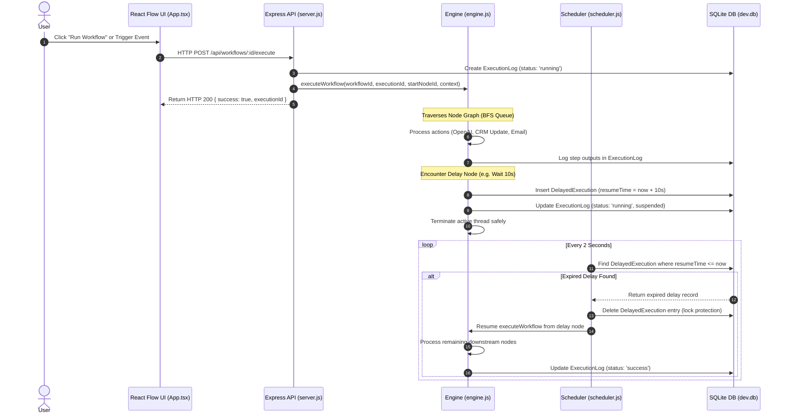

# 📐 NEURON_FLOW Architecture & Data Flow Guide

This document explains the technical architecture, data flows, database engine optimizations, and node design patterns of **NEURON_FLOW**.

---

## 🏛️ 1. High-Level Architecture Overview

NEURON_FLOW consists of three complementary layers:



1. **Client / Canvas Layer (`automation-workflow/frontend`)**:
   - Built on **React Flow** with custom nodes ([CustomNode.tsx](file:///d:/.vscode/workspace/automation-workflow/frontend/src/CustomNode.tsx)).
   - **Start Trigger Nodes**: Features clear **Play SVG badges** (`play_arrow`) on trigger container nodes (`StartNode`, `TriggerNode`, `ScheduleTriggerNode`, `GoogleFormTriggerNode`).
   - **Dual Sidebar Customization Sliders**:
     - Left Sidebar: Interactive **Sidebar Width** (180px–360px) and **Node Scale** (75%–125%) sliders.
     - Right Sidebar: Parameter sliders for Delay duration, Schedule interval, CRM score increment, If/Else condition threshold, Google Sheets row limit, and OpenAI temperature/tokens.

2. **Backend Engine Layer (`automation-workflow/backend`)**:
   - Express server handling workflow CRUD, execution streams, webhook endpoints, and CRM operations.
   - Centralized Prisma Client singleton ([db.js](file:///d:/.vscode/workspace/automation-workflow/backend/db.js)) configured with **WAL Mode** (`PRAGMA journal_mode=WAL;`) and `connection_limit=1` connection pool queueing to prevent SQLite database locking timeouts (`P1008`).

3. **Engine & Scheduler Layer (`engine.js` & `scheduler.js`)**:
   - Asynchronous BFS graph traversal engine.
   - Dedicated database-backed delay scheduler polling `DelayedExecution` entries every 2 seconds.
   - Runaway execution guard ensuring `nextRun` timestamps are persisted in the database *before* launching scheduled workflow runs.

---

## 🔄 2. Execution Sequence & Delay Suspension Flow

The diagram below shows how workflows process steps, suspend execution at a delay node, and resume automatically when the scheduler wakes up:



---

## 🗄️ 3. Database Schema Overview (`schema.prisma`)

| Model | Description | Key Attributes |
| :--- | :--- | :--- |
| **`User`** | System user profile | `id`, `email`, `name`, `workflows` |
| **`Workflow`** | Pipeline graph layout | `id`, `name`, `definition` (JSON string of nodes & edges), `isActive` |
| **`ExecutionLog`** | History & step logs | `id`, `workflowId`, `status` (`running`/`success`/`failed`), `logs`, `triggerData` |
| **`CRMContact`** | Simulated CRM leads | `id`, `name`, `email`, `status`, `score` |
| **`SimulatedEmail`** | Sent email records | `id`, `to`, `subject`, `body`, `sentAt` |
| **`DelayedExecution`** | Suspended delay states | `id`, `workflowId`, `executionId`, `nodeId`, `resumeTime`, `contextData` |

---

## 🛠️ 4. Dynamic Variable & Expression Evaluation

1. **Template Variable Replacement**:
   Placeholders such as `{{trigger.email}}` or `{{steps.nodeId.output}}` are dynamically resolved by traversing the execution context:
   ```javascript
   let resolvedText = text.replace(/\{\{([^}]+)\}\}/g, (_, path) => {
     const parts = path.trim().split('.');
     let val = context;
     for (const part of parts) val = val?.[part];
     return val ?? '';
   });
   ```

2. **Safe Code & Condition Evaluation**:
   If/Else conditions and custom JavaScript runner blocks are safely evaluated inside function wrappers:
   ```javascript
   const run = new Function('context', `
     try {
       const trigger = context.trigger || {};
       const steps = context.steps || {};
       return Boolean(${resolvedExpr});
     } catch(e) {
       return false;
     }
   `);
   ```

---

## 🚀 5. Quick Development Commands

- `npm run dev:all`: Launch dashboard, visual designer, and backend services concurrently.
- `npm run db:push:workflow`: Push Prisma schema updates to SQLite.
- `node automation-workflow/backend/clean_db.js`: Compact SQLite database & vacuum logs.

Happy developing! 🚀
