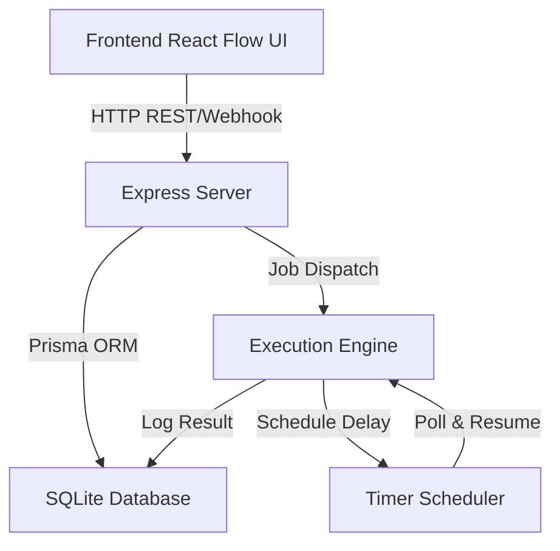
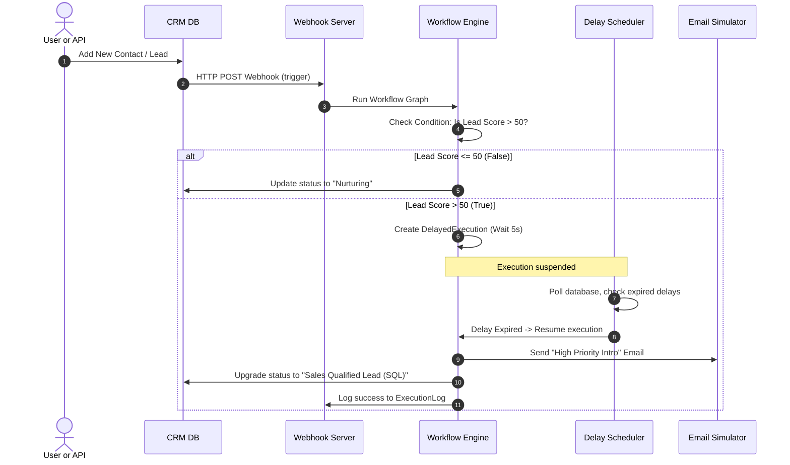

# Automation Workflow System - Architecture Guide

This document outlines the architecture, design choices, and flow of the drag-and-drop workflow execution engine.

---

## 🏗️ High-Level System Architecture

The automation workflow platform consists of three core layers working together:



1. **Frontend (Visual Canvas):**
   * Built on **React Flow** and styled using a premium Glassmorphism theme with **Material UI**.
   * Allows visual composition of trigger nodes, logic gates, actions, and delays.
   * Serialises the nodes and edges as JSON and stores them in the database via the backend API.

2. **Backend (API & Orchestrator):**
   * Built on **Express.js**.
   * Standard REST endpoints to CRUD workflows and read execution logs.
   * Dynamic **Webhook listener** (e.g. `/api/webhooks/:workflowId`) to handle external triggers.

3. **Workflow Engine & Delay Scheduler:**
   * Reads the active workflow graph and traverses the nodes using a topological/graph sorting evaluator.
   * Maintains state and executes actions sequentially.
   * Uses a database-backed **DelayedExecution** table to pause execution at "Delay" nodes, using a low-overhead scheduler loop to wake up and resume.

---

## 📈 Database Schema Models (Prisma + SQLite)

```prisma
model Workflow {
  id          Int            @id @default(autoincrement())
  name        String
  definition  String         // JSON string containing nodes & edges
  isActive    Boolean        @default(true)
  createdAt   DateTime       @default(now())
  updatedAt   DateTime       @updatedAt
  executions  ExecutionLog[]
}

model ExecutionLog {
  id          Int            @id @default(autoincrement())
  workflowId  Int
  workflow    Workflow       @relation(fields: [workflowId], references: [id])
  status      String         // pending, running, success, failed
  startedAt   DateTime       @default(now())
  finishedAt  DateTime?
  logs        String         // Step-by-step trace formatted in JSON/Text
}

model CRMContact {
  id          Int            @id @default(autoincrement())
  name        String
  email       String         @unique
  status      String         // lead, contact, customer
  score       Int            @default(0)
  createdAt   DateTime       @default(now())
}

model SimulatedEmail {
  id          Int            @id @default(autoincrement())
  to          String
  subject     String
  body        String
  sentAt      DateTime       @default(now())
}

model DelayedExecution {
  id          Int            @id @default(autoincrement())
  workflowId  Int
  executionId Int
  nodeId      String         // The delay node ID
  resumeTime  DateTime       // Timestamp when this delay expires
  contextData String         // JSON payload containing execution variable state
}
```

---

## 🔀 Step-by-Step Execution Sequence

Below is a detailed sequence of how a CRM event triggers marketing and sales workflows with delays and conditionals:



---

## 🚀 Key Supported Nodes

| Node Type | Category | Configurable Options | Action Behavior |
| :--- | :--- | :--- | :--- |
| **Webhook Trigger** | Trigger | Method, JSON schema | Listens on `/api/webhooks/:id` to start a flow. |
| **CRM Lead Created** | Trigger | Trigger options | Starts a flow when a simulated CRM lead is inserted. |
| **Delay / Timer** | Timer | Duration (seconds/minutes) | Pauses execution and logs context to resume later. |
| **If / Else** | Logic | Conditional expression | Branch outputs to `True` or `False` handles. |
| **Send Email** | Marketing | Subject, body, recipient | Appends a record to the `SimulatedEmail` table. |
| **Update CRM Lead** | CRM | Status, lead score increment | Updates values in the SQLite `CRMContact` table. |
| **Run Code** | Logic | Custom JS string | Safely evaluates JavaScript code using inputs. |
