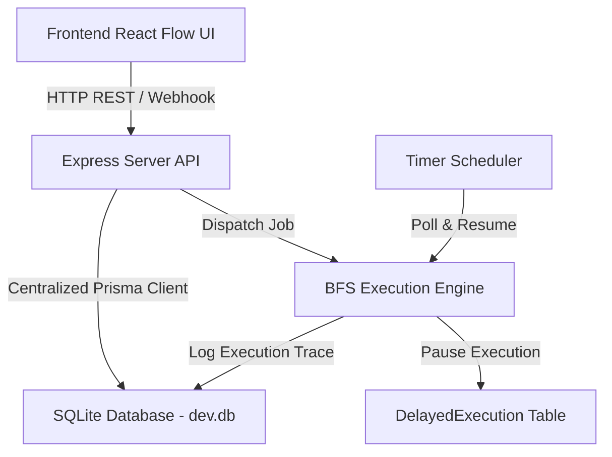

# ⚙️ Automation Workflow System - Architecture Guide

This document provides a clear guide to the architecture, database models, execution engine, and custom nodes of the **Automation Workflow Subproject**.

---

## 🏗️ High-Level System Architecture



---

## 🌟 Visual Custom Nodes & Interactive Sliders

### 1. Start Trigger Nodes with Play SVG Emblems
All trigger nodes feature a distinct **Play SVG Icon Overlay Badge** matching the node's theme color:
- **▶️ Manual Start Trigger** (`StartNode`): Includes a Play SVG emblem on the circular container.
- **⚡ Webhook & CRM Trigger** (`TriggerNode`): Lightning/CRM icon + Play SVG badge.
- **⏰ Schedule Timer Trigger** (`ScheduleTriggerNode`): Clock icon + Play SVG badge.
- **📝 Google Form Trigger** (`GoogleFormTriggerNode`): Form icon + Play SVG indicator.

### 2. Dual Sidebar Customization Sliders
- **Left Palette Sidebar**: Range sliders for **Sidebar Width** (`180px` to `360px`) and **Node Canvas Scale** (`75%` to `125%`).
- **Right Inspector Sidebar**: Parameter sliders for:
  - Delay Duration (Seconds)
  - Schedule Interval (Seconds/Minutes)
  - CRM Score Increment
  - If/Else Condition Score Threshold
  - Google Sheets Maximum Row Limit
  - OpenAI Temperature (`0.0` to `1.0`) & Token Output Length

---

## 🗄️ Database Schema Summary (`schema.prisma`)

```prisma
model Workflow {
  id          Int            @id @default(autoincrement())
  name        String
  definition  String         // JSON representation of React Flow nodes & edges
  isActive    Boolean        @default(true)
  createdAt   DateTime       @default(now())
  updatedAt   DateTime       @updatedAt
  executions  ExecutionLog[]
}

model ExecutionLog {
  id          Int            @id @default(autoincrement())
  workflowId  Int
  workflow    Workflow       @relation(fields: [workflowId], references: [id])
  status      String         // running, success, failed
  startedAt   DateTime       @default(now())
  finishedAt  DateTime?
  logs        String         // JSON step logs trace
}

model CRMContact {
  id          Int            @id @default(autoincrement())
  name        String
  email       String         @unique
  status      String         // lead, contact, customer
  score       Int            @default(0)
  createdAt   DateTime       @default(now())
}

model SimulatedEmail {
  id          Int            @id @default(autoincrement())
  to          String
  subject     String
  body        String
  sentAt      DateTime       @default(now())
}

model DelayedExecution {
  id          Int            @id @default(autoincrement())
  workflowId  Int
  executionId Int
  nodeId      String         // Delay node ID
  resumeTime  DateTime       // Expiration timestamp
  contextData String         // JSON context variables
}
```

---

## 🔒 Concurrency & Performance Safeguards

1. **SQLite WAL Mode Singleton (`db.js`)**:
   Enables `PRAGMA journal_mode=WAL;` and `PRAGMA busy_timeout=10000;` with `connection_limit=1` to serialize queries and prevent SQLite database lock errors (`P1008`).

2. **Scheduler Runaway Protection (`scheduler.js`)**:
   Persists `nextRun` timestamps in the database prior to triggering executions, eliminating infinite repeating loop bugs.

---

## 🚀 Supported Node Types

| Node Name | Type | Icon | Interactive Control |
| :--- | :--- | :--- | :--- |
| **Start Trigger** | Trigger | Play SVG | Trigger Entry |
| **Schedule Trigger** | Trigger | Clock + Play SVG | Interval Slider |
| **Google Form** | Trigger | Form + Play SVG | Webhook Endpoint |
| **Delay / Timer** | Timer | Hourglass | Duration Slider |
| **If / Else** | Logic | Call Split | Score Threshold Slider |
| **Google Sheets** | Action | Table Chart | Max Rows Slider |
| **OpenAI GPT** | AI Core | Psychology | Temperature & Tokens Sliders |
| **Send Email / Slack / CRM** | Action | Email / Forum / Person | Recipient & Body inputs |

---

Happy Orchestrating! 🚀
