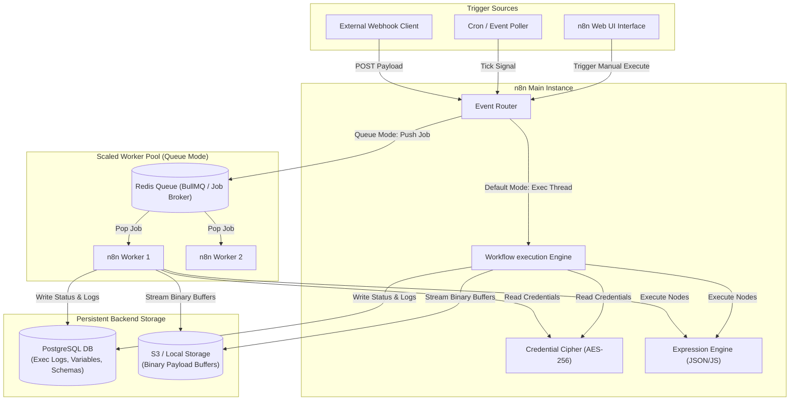
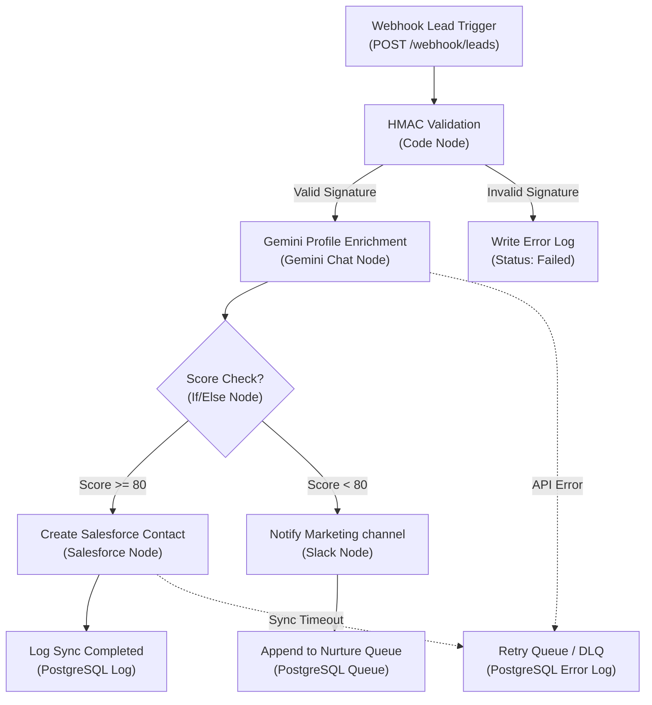

# n8n Core Architecture & Advanced Automation Master Guide

This guide details the core architecture, data lifecycles, and scaling patterns of n8n. It provides a production-grade blueprint for designing, deploying, and optimizing complex enterprise workflows.

---

## 📂 1. n8n Core Architecture

### What is n8n & Why It Exists
n8n is an extendable, source-available workflow automation platform that allows developers and systems to connect APIs, databases, files, and AI services using a node-based visual designer.
Unlike closed SaaS platforms (e.g., Zapier, Make), n8n can be hosted on-premise, allowing it to satisfy strict data privacy requirements (GDPR, HIPAA, SOC2), eliminate payload size limits, support custom scripts, and offer consumption-independent scaling.

### Core Components & Architecture Map

The diagrams below represent the internal components and data flow streams of n8n in both single-instance and scaled multi-worker deployment topologies:

```
+--------------------------------------------------------------------------------+
|                             n8n Single Node Topology                           |
|                                                                                |
|  +------------------+     +--------------------+     +----------------------+  |
|  | Webhook Triggers |     |  Polling Triggers  |     |   Manual UI Run      |  |
|  +--------+---------+     +---------+----------+     +----------+-----------+  |
|           |                         |                           |              |
|           +-------------------------+---------------------------+              |
|                                     |                                          |
|                                     v                                          |
|                       +---------------------------+                            |
|                       |   Event-Driven Router     |                            |
|                       +-------------+-------------+                            |
|                                     |                                          |
|                                     v                                          |
|                       +---------------------------+                            |
|                       |  Workflow Engine Thread   |                            |
|                       +-------------+-------------+                            |
|                                     |                                          |
|                   +-----------------+-----------------+                        |
|                   v                                   v                        |
|        +--------------------+               +--------------------+             |
|        |  Expression Engine |               |  Credential Cipher |             |
|        +--------------------+               +--------------------+             |
|                   |                                   |                        |
|                   v                                   v                        |
|        +--------------------+               +--------------------+             |
|        | JS/Python Sandbox  |               |  SQLite/Postgres   |             |
|        +--------------------+               +--------------------+             |
+--------------------------------------------------------------------------------+
```



---

## ⚡ 2. Workflow Execution & Data Lifecycle

As jobs traverse nodes, data is transformed and logged. Below is a detailed view of the sequence from start to finish:

```
Workflow Definition Loaded
           │
           ▼
[Trigger Node Instantiated]  ◄── Intake incoming JSON / Binary payload
           │
           ▼
[Context Creation]           ◄── Inject environment variables and credentials
           │
           ▼
[BFS Execution Queue Loop]   ◄── Traverse node connection streams
           │
  ┌────────┴────────┐
  ▼                 ▼
[Expression]   [Data Transforms]
  │                 │
  └────────┬────────┘
           │
           ▼
[Check Output Node Edges]    ◄── Route true/false branching or merge connections
           │
           ▼
[Execution Logs Recorded]    ◄── Save execution variables and JSON context in DB
```

### Execution Context & Pinned Data
* **Execution Context:** The state object created for a workflow run, which contains items, binary files, metadata, credentials, and environment parameters.
* **Pinned Data:** Used during developer editing to mock node execution outputs. Pinned nodes do not run their backend logic; instead, they output their saved JSON cache, protecting external APIs from excessive testing calls.
* **Items Array Model:** n8n passes data between nodes as a JSON array of objects: `[{ json: { key: val }, binary: { name: { ... } } }]`. A node operates on each element of the items list sequentially.

---

## 🛠️ 3. Node Directory & Technical Mechanics

### 1. Trigger Nodes
* **Webhooks:** Expose HTTP endpoints (`/webhook/` and `/webhook-test/`). Webhook endpoints are fast and lightweight, returning a transaction ID before executing the workflow asynchronously in the background.
* **Pollers (e.g., Cron, IMAP, DB Triggers):** Periodically check state changes. n8n holds state variables in the `WorkflowStaticData` table to track the last checked timestamp, preventing duplicate reads.

### 2. Logic Nodes
* **IF/Switch:** Route items by evaluating expressions. They split arrays based on condition results.
* **Merge:** Combines data streams. It supports `Append` (joins arrays), `Merge by Position`, `Multiplex` (cross-joins), and `Wait for Both` (synchronizes parallel execution).

### 3. AI Nodes (LangChain Agents & RAG)
* **Agents:** Orchestrate task-solving loops by calling tools (HTTP Request, Code nodes) based on user prompts.
* **Vector Databases (Qdrant, Pinecone):** Retrieve contexts using embeddings, injecting matches into LLM prompt chains (RAG).

### 4. Code & Programming Nodes
* Runs custom JS or Python scripts. Within JavaScript code blocks:
  - Use `return $input.all()` to access incoming item lists.
  - Access properties using `$json.variableName` or `$item(0).$node["NodeName"].json.id`.

### 5. Authentication Engines
* **Basic Auth / API Key / HMAC:** Injected directly into header objects on execution.
* **OAuth2:** n8n securely coordinates the authorization code flow, automatically fetching and saving updated `refresh_token` payloads to the database.

---

## 🚀 4. Enterprise AI Lead Qualification & CRM Orchestration Pipeline

This section defines a production-ready, highly scaled automation workflow implemented under a strict 15-point engineering lifecycle.

### 1. Business Analysis
* **Problem:** Marketing campaigns ingest high volumes of raw leads. Manually enriching these profiles, scoring them, and routing them to CRMs (like Salesforce) creates delays and leads to missed opportunities.
* **Solution:** An automated pipeline that validates incoming webhook leads, enriches their profiles using the Gemini API, routes qualified high-scoring enterprise leads directly to Salesforce, and drops low-scoring leads into a queue while sending a Slack alert.

### 2. Workflow Diagram

The system architecture and node streams of this pipeline are detailed below:

```
                    +------------------------------------+
                    |        Incoming Lead Webhook       |
                    +-----------------+------------------+
                                      |
                                      v
                    +-----------------+------------------+
                    |  Validate Signature (HMAC-SHA256)  |
                    +-----------------+------------------+
                                      |
                                      v
                    +-----------------+------------------+
                    |     Enrich Profile via Gemini API  |
                    +-----------------+------------------+
                                      |
                                      v
                    +-----------------+------------------+
                    |    Score & Filter (If/Else Node)   |
                    +--------+------------------+--------+
                             |                  |
                    (Score >= 80)          (Score < 80)
                             |                  |
                             v                  v
            +----------------+-------+  +-------+----------------+
            | Create Salesforce Contact|  | Send Slack Notification|
            +------------------------+  +------------------------+
```



### 3. Step-by-Step Explanation
1. **Webhook Lead Trigger:** Listens for incoming POST requests containing contact email and name.
2. **HMAC Signature Validation:** Validates the signature header against the payload using a shared secret key to prevent unauthorized spoofing.
3. **Gemini Profile Enrichment:** Sends the lead metadata to the Gemini API to analyze the business profile, company size, and domain value.
4. **Lead Score Check:** Runs an expression to evaluate the composite lead score: `Score = DomainQuality(1-100) * 0.4 + CompanySizeScore * 0.6`.
5. **Conditional Branching:**
   - **Branch A (Score >= 80):** Qualified leads are pushed directly to Salesforce.
   - **Branch B (Score < 80):** Unqualified leads trigger a Slack notification to the nurture team and are queued in the database.
6. **Error Handlers:** Catch API failures and write them to a Dead Letter Queue (DLQ) in PostgreSQL for manual remediation.

### 4. Node Configuration (JSON Schema)
```json
{
  "nodes": [
    {
      "parameters": {
        "httpMethod": "POST",
        "path": "leads-intake",
        "options": {
          "rawBody": true
        }
      },
      "id": "webhook-trigger-node",
      "name": "Webhook Lead Trigger",
      "type": "n8n-nodes-base.webhook",
      "typeVersion": 1,
      "position": [100, 300]
    },
    {
      "parameters": {
        "jsCode": "const crypto = require('crypto');\nconst signature = $input.item.json.headers['x-hub-signature'];\nconst secret = $env.WEBHOOK_SECRET;\nconst computed = crypto.createHmac('sha256', secret).update($input.item.json.bodyRaw).digest('hex');\n\nif (signature !== `sha256=${computed}`) {\n  throw new Error('Invalid HMAC Signature Authenticity Check Failed');\n}\nreturn { json: { verified: true, body: $input.item.json.body } };"
      },
      "id": "hmac-validator-node",
      "name": "HMAC Security Verification",
      "type": "n8n-nodes-base.code",
      "typeVersion": 1,
      "position": [300, 300]
    },
    {
      "parameters": {
        "model": "gemini-1.5-pro",
        "prompt": "Evaluate the lead profile. Email: {{ $json.body.email }}. Company: {{ $json.body.company }}. Return only a JSON object containing keys 'score' (0-100), and 'summary' (brief details)."
      },
      "id": "gemini-enrich-node",
      "name": "Gemini AI Enrichment",
      "type": "n8n-nodes-base.gemini",
      "typeVersion": 1,
      "position": [500, 300]
    },
    {
      "parameters": {
        "conditions": {
          "number": [
            {
              "value1": "={{ $json.score }}",
              "operation": "largerEqual",
              "value2": 80
            }
          ]
        }
      },
      "id": "logic-ifelse-node",
      "name": "Lead Qualification Check",
      "type": "n8n-nodes-base.if",
      "typeVersion": 1,
      "position": [700, 300]
    }
  ]
}
```

### 5. Connection Details
* **Webhook Lead Trigger (Output)** -> connects to **HMAC Security Verification (Input)**.
* **HMAC Security Verification (Output)** -> connects to **Gemini AI Enrichment (Input)**.
* **Gemini AI Enrichment (Output)** -> connects to **Lead Qualification Check (Input)**.
* **Lead Qualification Check (True Output)** -> connects to **Salesforce Create Contact (Input)**.
* **Lead Qualification Check (False Output)** -> connects to **Slack Notify & postgres Nurture Queue (Input)**.

### 6. Expressions
* **Verify Header Signature:** `={{ $input.item.json.headers['x-hub-signature'] }}`
* **Validate Body Value:** `={{ $json.body.email }}`
* **Filter Rule Check:** `={{ $json.score >= 80 }}`
* **Salesforce Description Template:**
  ```text
  Enterprise lead qualified by Gemini AI. Summary: {{ $node["Gemini AI Enrichment"].json.summary }}. Score: {{ $json.score }}.
  ```

### 7. Variables
* **System Variables:**
  - `$env.WEBHOOK_SECRET` (Secure validation key)
  - `$env.SALESFORCE_CLIENT_SECRET` (OAuth encryption credential)
* **Local Variables:**
  - `score` (computed rating variable)
  - `summary` (extracted company biography profile text)

### 8. JSON Payloads

#### Incoming Payload:
```json
{
  "headers": {
    "x-hub-signature": "sha256=1bc8c5db1d5fe4e8c56c8671607de385e054a3a60aefc9fa55341258671de3a8",
    "content-type": "application/json"
  },
  "body": {
    "email": "enterprise-buyer@corp.com",
    "name": "Jane Doe",
    "company": "Global MegaCorp",
    "employees": 1500
  }
}
```

#### Output Payload (Gemini Enrichment node):
```json
{
  "score": 92,
  "summary": "Premium enterprise account domain corp.com matching active buyer profile with >1000 employees."
}
```

### 9. API Example (Webhook Trigger)
```bash
curl -X POST https://n8n.yourdomain.com/webhook/leads-intake \
  -H "Content-Type: application/json" \
  -H "x-hub-signature: sha256=1bc8c5db1d5fe4e8c56c8671607de385e054a3a60aefc9fa55341258671de3a8" \
  -d '{"email":"enterprise-buyer@corp.com","name":"Jane Doe","company":"Global MegaCorp"}'
```

### 10. Error Handling & Dead Letter Queue (DLQ)
* **Global Error Trigger Node:** Listens for execution failures in any node.
* **Fallback Route:** In the event of a timeout or rate-limiting block from Gemini/Salesforce, the failed payload is caught, formatted, and appended to the PostgreSQL database table `LeadErrorDLQ` for automated retry logic or administrative alert routing.

### 11. Security
* **HMAC verification:** Validates that incoming webhook payloads originate from the authentic lead form service, mitigating DDoS risks.
* **Secrets Management:** Credentials are encrypted in transit and stored at rest using AES-256 with the encryption key managed via environment variables.

### 12. Optimization
* **Batch Inserts:** Database writes (e.g., nurture queues) are batched inside the PostgreSQL node to minimize connection pool overhead.
* **Redis Queue Cache:** Scaled workers run in "Queue Mode" to handle traffic spikes smoothly without degrading database response times.

### 13. Production Deployment (Docker Compose)
This multi-container Docker Compose file orchestrates a highly available, scaled n8n cluster containing a Redis job broker, a Postgres database, a master node, and queue worker pools:

```yaml
version: '3.8'

services:
  # Database
  postgres:
    image: postgres:15-alpine
    environment:
      POSTGRES_USER: n8n_admin
      POSTGRES_PASSWORD: SecretPassword123
      POSTGRES_DB: n8n_db
    volumes:
      - pg-data:/var/lib/postgresql/data
    restart: always

  # Job Broker for Queue mode
  redis:
    image: redis:7-alpine
    restart: always

  # n8n Main Instance
  n8n-main:
    image: n8nio/n8n:latest
    ports:
      - "5678:5678"
    environment:
      - DB_TYPE=postgresdb
      - DB_POSTGRESDB_HOST=postgres
      - DB_POSTGRESDB_USER=n8n_admin
      - DB_POSTGRESDB_PASSWORD=SecretPassword123
      - DB_POSTGRESDB_DATABASE=n8n_db
      - EXECUTIONS_MODE=queue
      - QUEUE_BULLMQ_REDIS_HOST=redis
      - N8N_ENCRYPTION_KEY=YourEncryptionKeyMustBeStrong
    depends_on:
      - postgres
      - redis
    restart: always

  # n8n Scaled Worker Node
  n8n-worker:
    image: n8nio/n8n:latest
    command: worker
    environment:
      - DB_TYPE=postgresdb
      - DB_POSTGRESDB_HOST=postgres
      - DB_POSTGRESDB_USER=n8n_admin
      - DB_POSTGRESDB_PASSWORD=SecretPassword123
      - DB_POSTGRESDB_DATABASE=n8n_db
      - EXECUTIONS_MODE=queue
      - QUEUE_BULLMQ_REDIS_HOST=redis
      - N8N_ENCRYPTION_KEY=YourEncryptionKeyMustBeStrong
    depends_on:
      - n8n-main
    restart: always

volumes:
  pg-data:
```

### 14. Monitoring
* **Health Check Endpoint:** `/healthz` provides status checks for container orchestrators.
* **Execution Metrics:** Integrates with Prometheus via n8n's metrics exporter to track memory overhead, active queue backlogs, webhook latencies, and execution failure ratios.

### 15. Future Improvements
* **Advanced RAG Routing:** Introduce a semantic search vector store step prior to enrichment. This queries historical customer interactions to calculate affinity before calling the LLM.
* **Auto-Scaling Workers:** Configure Kubernetes HPA (Horizontal Pod Autoscaler) rules to scale worker containers dynamically in response to Redis queue depth metrics.
